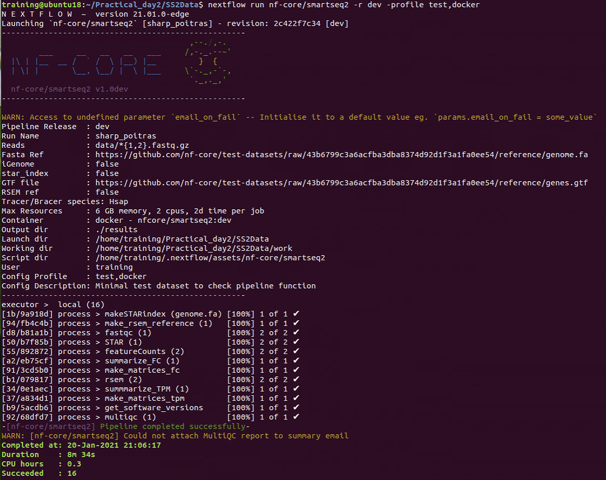

# Generate expression matrix for smartseq2 (SS2) and 10x single-cell RNA-seq data from raw reads

> Taught by:: 'Xiaohui Zhao'  
> Contact E-mail:: 'xz289@cam.ac.uk'  
> Data Type:: '10x, SmartSeq2'  

## Objectives
By the ned of this short session, you should understand;s
 * How to generate an expression matrix from SS2 and 10x raw reads fastq files;
 * How to perform some basic quality control for both reads and cells;
 * How to use 10x cellranger pipeline for same/different GEM wells sample;
 * How to understand and use cellranger output;
 * How to pass the matrix for further downstream analysis.  

## You will need
 * Linux system working enviroment and basic knowledge of linux;  

 Command     |   usage                                                 |
 --------    | --------------------------------------------------------|
 cd ~        |  change back to the home directory                      |
 mv          |  rename file/directory                                  |
 rm          |  remove file (careful using)                            |
 head/tail   |  show the head/tail of the file                         |
 ls          |  list files/directories in main directory               |
 tree        |  view files and directories in a hierarchical structure |
 mkdir       |  make directory                                         |
 zcat        |  view gzip file                                         |

 * SS2: paired fastq files (both cDNAs); 10x: R1 (barcode+UMIs), R2(cDNAs);
 * fastQC for reads quality control;
 * multiQC for reproducible report summary;
 * Hisat2/STAR index for Human (GRCh38);
 * cellranger install + reference geneome;
 * samtools for sorting the bam files;
 * subread featureCounts for generating counts matrix for SS2.
 The versions of the above software/package are listing below.  

 | Resource              | Version        |
 | --------------------- | ---------------|
 | FastQC                | 	v0.11.8       |
 | MultiQC	             | 	v1.8          |
 | STAR                  | 	v2.7.2c       |
 | Hisat2                |   v2.2.1       |
 | samtools              |   v1.11        |
 | featureCounts         |   v2.0.1       |
 | cellranger            |   v5.0.1       |
 | Reference             |  GRCh38-2020A  |

 Because of the time and memory problem, we have saved aligner index for transcripts, and some intermediate processed data or final results in the course folder **Practical_day2**.

## Introduction

In this practical, due to the 10x cellranger pipeline is used high memory, we will not run the 10x pipeline in our practical. You could try SS2 pipeline for one cell, and generate expression matrix for three cells using already saved processed bam files for the other two cells. We will concentrate on 10x cellranger pipeline, since this is the process with most differences compared to bulk RNASeq by using UMIs (unique molecular identifiers). Instead of running it, we will explore cellranger count, aggr pipeline via the cellranger home page online. [10xcellranger](https://support.10xgenomics.com/single-cell-gene-expression/software/pipelines/latest/what-is-cell-ranger) And also go through some examples of *web_summary.html* files.  

### Example Data and publication link & other useful information
Description               | URL
---------------------     | ----------
Publication               | [[Nature]](https://) [[DOI]](https://doi.org/10.1038/s41586-018-0698-6)
Raw Data(10x)             | ArrayExpress EMBL-EBI [E-MTAB-6701](https://www.ebi.ac.uk/arrayexpress/experiments/E-MTAB-6701)
Raw Data(SS2)             | ArrayExpress EMBL-EBI [E-MTAB-6678](https://www.ebi.ac.uk/arrayexpress/experiments/E-MTAB-6678)
---------------------     | ----------
Organism                  | Homo sapiens
Design                    | cell type comparison
Gestation age             | 6-12 wks
Tissue                    | Placenta and Decidual

## 1) SmartSeq2

Libraries were sequenced aiming at an average depth of 1 million reads/cell, on an Illumina HiSeq 2000 with v4 chemistry (**paired-end 75-bp reads**). Libraries were made using Nextera XT	RNA was extracted, cDNA created and amplified, as part of the smart-seq 2 protocol. Three cells are chosen for our practical, the library ids are **23728_8_119, 24087_5_146 and 24087_7_73**.

### Exercise 1:   
### Customised Pipeline running with aligner Hisat2 (Similar as bulk RNASeq)

 **a) Build index** (don't run, we already saved it) 
You need to build hisat2 reference for alignment if you did not have. There are different indices to build depends on your align requirements, eg. HFM index, HGFM index with SNPs or transcripts or both. Here we use HFM index. You do not need to build index as we already saved them in the practical.

               cd ./Practical_day2
               hisat2-build ./refdata-gex-GRCh38-2020-A/fasta/genome.fa ./refdata-gex-GRCh38-2020-A/fasta/GRCh38

The following files will be generated:  

            GRCh38.1.ht2, GRCh38.2.ht2, GRCh38.3.ht2, GRCh38.4.ht2,
            GRCh38.5.ht2, GRCh38.6.ht2, GRCh38.7.ht2, GRCh38.8.ht2.

 **b) Check fastq file, quality contorl (fastQC+MultiQC) Align**  

               cd ./Practical_day2/Data/SS2Data
               zcat ./Fastq/23728_8_119.1.fastq.gz | head

  

We will skip the QC check&trimming step in this practical for SmartSeq2 data.  

               hisat2 -x ../refdata-gex-GRCh38-2020-A/fasta/GRCh38 \
                      -1 ./Fastq/23728_8_119.1.fastq.gz \
                      -2 ./Fastq/23728_8_119.2.fastq.gz \
                      -S ./Fastq/23728_8_119.sam

  

Unique alignment percentage is 76.5%.

 **c) Data sorting**  

               samtools view -bS ./Fastq/23728_8_119.sam > ./Fastq/23728_8_119_unsorted.bam
               samtools sort -o ./Fastq/23728_8_119_sorted.bam ./Fastq/23728_8_119_unsorted.bam
               rm ./Fastq/23728_8_119.sam

 **d) Reads counts and extract the counts columns**  
       * **One sample**

               featureCounts -p -a ../refdata-gex-GRCh38-2020-A/genes/genes.gtf \
                             -t exon -g gene_id \
                             -o ./Fastq/23728_8_119_featureCounts.txt ./Fastq/23728_8_119_sorted.bam

               cut -f1,7 ./Fastq/23728_8_119_featureCounts.txt > ./Fastq/23728_8_119_featureCounts_mat.txt

 
 
 

  * **multiple samples**

              featureCounts -p -a ../refdata-gex-GRCh38-2020-A/genes/genes.gtf \
                            -t exon -g gene_id \
                            -o ./Fastq/SS2_featureCounts.txt \
                            ./Fastq/Processed_Bam/23728_8_119_sorted.bam \
                            ./Fastq/Processed_Bam/24087_5_146_sorted.bam \
                            ./Fastq/Processed_Bam/24087_7_73_sorted.bam

               cut -f1,7-9 ./Fastq/SS2_featureCounts.txt > ./Fastq/SS2_EM.txt
               head ./Fastq/SS2_EM.txt

 
 

 **e) Use R to call your expression matrix**

  

### Challenge 1
* Write a simple bash script pipeline with another pseduo-aligner with sample 23728_8_119 & check the expression matrix count for gene **PAEP**.
Do you need both the reference genome and transcript annotation files for the pseduo-aligner?

## 2) 10x cellranger

The libraries were sequenced on an Illumina HiSeq 4000 with v4 chemistry (*Paired-end*)  **Read 1**: 26 cycles;  
**i7 index**:8 cycles, **i5 index**: 0 cycles.  
**Read 2**: 98 cycles.

  

### Sample Information
| library_id                | Number of Cells    |
| ------------------------- |     ---------      |
| FCA7167219                |        672         |
| FCA7167221                |        1171        |
| FCA7167222                |        1764        |

**Reminder:**Due to the memory problem for running **cellranger**, we will not run our cellranger analysis during our practical. However, we will have a look at different examples of cellranger output report to understand initial QC.

### cellranger count-single sample or samples from same GEM well.(**Don't run**)

           cd ./Practical_day2/Data/10xData
           cellranger count --id=FCA7167219_cellout \
                            --transcriptome= ../refdata-gex-GRCh38-2020-A \
                            --fastqs=FCA7167219_fastq \
                            --sample=FCA7167219 \
                            --expect-cells=1000 \
                            --localcores=8 \
                            --localmem=64

We will use three files in the directory **filtered_feature_bc_matrix/**, which contains only detected cellular barcodes.  

              barcodes.tsv.gz           features.tsv.gz              matrix.mtx.gz

To view these gz files, you can use the following barcodes

              zcat barcodes.tsv.gz | head
or

              gzip -cd barcodes.tsv.gz | head

#### Summary report web_summary.html    

  

### cellranger aggr-merge/normalise samples from different GEM wells (**Don't run**)
*cellranger aggr is not designed for combining multiple sequencing runs of the same GEM Well. For that, you should pass a list of FASTQ files from multiple sequencing runs of the same GEM well to the --fastqs argument of cellranger count.*

              cellranger aggr --id=FCA123 \
                              --csv=FCA123_libraries.csv \
                              --normalize=none

### Exercise 2: Basic QC with web_sumamry.html file (Practical_day2/Cellranger_Reports)
General Question: which web_summary.html files are proper? If they are not good, why?
* What is the analysis count pipeline running for?
  * Gene expression
  * Targeted Gene expression (GEX)
  * Feature Barcode
  * Feature Barcode only
* How many cells in the report? How is your barcode rank plot, is that good or bad?
* How much data do you have per cell? ( reads per cell, genes per cell?)
* How is the mapping quality of your data? (mapping fraction, align fraction to exon, transcript...)
* If you add the option in your count pipeline --expect-cells 1000, what is the barcode rank plot looks like? How about the other summary?
* Does the coverage variation affect your data?
* If your cells are variable, reads per cells make sense or not?
* Which genes are highly differentially expressed from different reports?

### Challenge 2:
If you have the two publications 10x data from the same tissue, but with different chemistry protocol. You would like to combine these two data sets, which pipeline you should choose, "count", "aggr", "reanalyse"? (Hint: check aggr and reanalyse)

### Exercise 3: Count matrix
* Check the dimension of the count matrix;
* if we change the aggr pipeline option --normalize from "none" to default "mapped", what is going to happen to the count matrix?
* R Matrix package or seurat package (**Read10x** to get the expression matrix), which one you prefer? How to assign your matrix rownames either by gene_id or gene_name?

## Additional Information for Monoliths pipeline using NextFlow

We know single cell RNASeq analysis is high memory and also need more cpus to run based on the large number of cells. Thus, a high-performance-computing system is needed to be set up to make the run. Nextflow is a nice tools which has developed nf-core pipelines. You could install nextflow and any of Docker, Singularity or Podman for full pipeline reproducibility. Full details to check in the following two links,

                      https://www.nextflow.io/  https://nf-co.re/

Before running, you need to export your nextflow path, and if you use singularity you also need to export your singularity path. Additionally, you need to add **NXF_OPTS='-Xms1g -Xmx4g'** line, which will stop the nextflow program itself using up too much memory. You may also need to customise your .nextflow/config file if you had "Slurm" job submitting. To explore the two pipelines, you could go to the following links for usage details.

### smartseq2 pipeline devlopment version (nf-core/smartseq2)

                https://nf-co.re/smartseq2/dev/usage

### 10x pipeline devlopment version (nf-core/scrnaseq)

                https://nf-co.re/scrnaseq/1.0.0/docs/usage  

The following command lines are the ones I ran in our hpc for both smartseq2 and 10x with a defined config file.

eg.

              nextflow run nf-core/smartseq2 -r dev -profile singularity \
                                             --skip_tracer --skip_bracer \
                                             --reads '*{1,2}.fastq.gz' \
                                             --fasta ../../refdata-gex-GRCh38-2020-A/fasta/ \
                                             --gtf ../../refdata-gex-GRCh38-2020-A/genes/ \
                                             --aligner star \
                                             --email test@gmail.ac.uk \
                                             -with-report 10x_report.html &> 10x_nextflow_command.resume.log &

eg. (default aligner is alevin)

               nextflow run nf-core/scrnaseq -r 1.0.0 -resume --reads '*_R{1,2}_001.fastq.gz' \
                                             --fasta ../refdata-gex-GRCh38-2020-A/fasta/ \
                                             --gtf ../refdata-gex-GRCh38-2020-A/genes/ \
                                             -profile singularity \
                                             --email test@gmail.ac.uk \
                                             -with-report 10x_report.html &> 10x_nextflow_command.resume.log &

### Highlights for nextflow (Please have a go after this course)
 * Reproducible; (-resume,  -r options)
 * Full-report of the usage of CPU, memory, time (report.html);
 * Full-report of all the libraries initial QC (multiqc.html);
 * Full summary log file for running (nextflow_command.log);
 * HPC efficiency.
 * smartseq2 pipeline is also include TCR and BCR analysis.
 * ....

| Resource              | Version         |
| --------------------- | --------------- |
| Nextflow              | 	v20.10.0      |
| nf-core/smartseq2     | 	v1.0dev       |
| nf-core/scrnaseq      | 	v1.0.0        |

### Exercise 3 :
* Run nf-core/smartseq2 test, check the output results folder.

          nextflow run nf-core/smartseq2 -resume -r dev -profile test,docker

* Take Home Run if you had HPC singularity container.

           nextflow run nf-core/scrnaseq -resume -r 1.0.0 -profile test,Singularity

### Challenge 3, Homework:
Try nf-core/scrnaseq using a small study, and go through your multiQC report. Explore different aligner tools built-in nf-core/scrnaseq and cehck the Expression matrix difference.

## Useful References papers or analysis tools links
* “Analysis of single cell RNA-seq data” by Sanger Hemberg group: [scRNASeq](https://scrnaseq-course.cog.sanger.ac.uk/website/index.html)
* [nf-core/smartseq2](https://github.com/nf-core/smartseq2)
* [nf-core/scrnaseq](https://github.com/nf-core/scrnaseq)
* [cam-hpc-slurm](https://docs.hpc.cam.ac.uk/hpc/user-guide/)
* [snakemake-scrnaseq](https://github.com/snakemake-workflows/single-cell-rna-seq)
* [doprSeqPipe](https://hoohm.github.io/dropSeqPipe/)
* [Satija-cellnumber](https://satijalab.org/howmanycells)
* Fangda Song et al, Nature Communications volume 11, Article number: 3274 (2020)

### Contact ###

Contact Xiaohui Zhao (xz289 -at- cam.ac.uk) for related queries.
