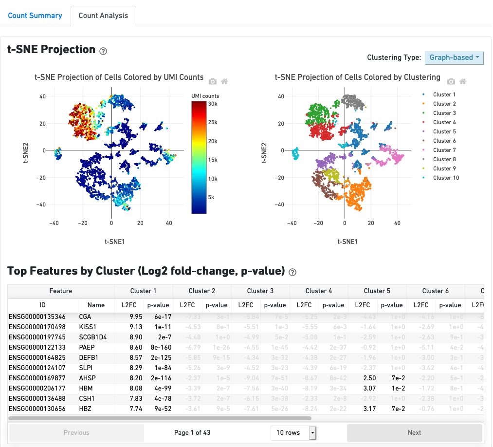

# Generate the expression matrix for smartseq2 (SS2) and 10x single-cell RNA-seq data from raw reads

> Taught by:: 'Xiaohui Zhao' <br>
> Contact E-mail:: 'xz289@cam.ac.uk' <br>
> Data Type:: '10x, SmartSeq2' <br>

### Objectives
By the end of this short session, you should understand:
 * How to generate an expression matrix from SS2 and 10x raw reads (fastq files);
 * How to perform some basic quality control for both reads and cells;
 * How to use the 10x cellranger pipeline for different GEM wells and multiple runs of the same well;
 * How to understand and use the cellranger output;
 * How to pass the matrix for further downstream analysis. <br>

### You will need
 * Linux system working enviroment and basic knowledge of linux; <br>


 Command     |   usage                                                 |
 --------    | --------------------------------------------------------|
 cd ~        |  change back to the home directory                      |
 mv          |  rename file/directory                                  |
 rm          |  remove file (be careful using this!)                   |
 head/tail   |  show the head/tail of the file                         |
 ls          |  list files/directories in main directory               |
 tree        |  view files and directories in a hierarchical structure |
 mkdir       |  make directory                                         |
 zcat        |  view gzip file                                         |

 * SS2: paired fastq files (both cDNAs); 10x: R1 (barcode+UMIs), R2(cDNAs);
 * fastQC for reads quality control;
 * multiQC for reproducible report summary;
 * Hisat2/STAR index for Human (GRCh38);
 * cellranger install + reference genome;
 * samtools for sorting the bam files;
 * subread featureCounts for generating counts matrix for SS2.
 The versions of the above software/package are listing below. <br>

 | Resource              | Version        |
 | --------------------- | ---------------|
 | FastQC                | 	v0.11.8       |
 | MultiQC	             | 	v1.8          |
 | STAR                  | 	v2.7.2c       |
 | Hisat2                |   v2.2.1       |
 | samtools              |   v1.11        |
 | featureCounts         |   v2.0.1       |
 | cellranger            |   v5.0.1       |
 | Reference             |  GRCh38-2020A  |

To run this practical in the alotted time with the given compute capacity, we have pre-prepared the aligner index for transcripts, and some intermediate processed data and final results in the course folder **Practical_day2**.

### Introduction

First, you will run the SS2 pipeline for one cell, and generate an expression matrix for three cells using prepared bam files for the other two cells. Next, you will concentrate on the 10x cellranger pipeline, since this process uses UMIs (unique molecular identifiers) and is the most different from bulk RNASeq. The 10x cellranger pipeline requires a lot of memory capacity, therefore we will not run it in the practical. Instead, you will explore cellranger counts, and aggr pipeline via the cellranger home page online. [10xcellranger](https://support.10xgenomics.com/single-cell-gene-expression/software/pipelines/latest/what-is-cell-ranger) Finally, you will go through some examples of *web_summary.html* files. <br>

### Example Data and publication link & other useful information
Description               | URL
---------------------     | ----------
Publication               | [[Nature]](https://) [[DOI]](https://doi.org/10.1038/s41586-018-0698-6)
Raw Data(10x)             | ArrayExpress EMBL-EBI [E-MTAB-6701](https://www.ebi.ac.uk/arrayexpress/experiments/E-MTAB-6701)
Raw Data(SS2)             | ArrayExpress EMBL-EBI [E-MTAB-6678](https://www.ebi.ac.uk/arrayexpress/experiments/E-MTAB-6678)
---------------------     | ----------
Organism                  | Homo sapiens
Design                    | cell type comparison
Gestation age             | 6-12 wks
Tissue                    | Placenta and Decidual


## Part I: SmartSeq2
## Exercise 1:  Customised Pipeline running with aligner Hisat2 (Similar to bulk RNASeq)

Libraries were sequenced aiming at an average depth of 1 million reads/cell, on an Illumina HiSeq 2000 with v4 chemistry (**paired-end 75-bp reads**). In brief, RNA was extracted, cDNA was created and amplified, and libraries were generated using the Nextera XT kit per the smartseq2 protocol. We have chosen three cell for the practical - their library or cell ids, determined from the combination of nextera indices, are **23728_8_119, 24087_5_146 and 24087_7_73**. You can see the high quality of the reads below for read 1.


<br>
<br>

1. **Build index** (**DON'T RUN THIS!** It takes ages and we've already saved it!)<br>
You would normally need to build a hisat2 reference for the alignment. There are different indices to build depending on your alignment requirements, eg. HFM index, HGFM index with SNPs or transcripts or both. Here you will use a HFM index. You do not need to build the index as we already saved it in the practical.
```shell
cd ./Practical_day2
hisat2-build ./refdata-gex-GRCh38-2020-A/fasta/genome.fa ./refdata-gex-GRCh38-2020-A/fasta/GRCh38
```
The following files will be generated: <br>

            GRCh38.1.ht2, GRCh38.2.ht2, GRCh38.3.ht2, GRCh38.4.ht2,
            GRCh38.5.ht2, GRCh38.6.ht2, GRCh38.7.ht2, GRCh38.8.ht2.

2. **Check fastq file** <br>
```shell
cd ./Practical_day2/SS2Data
zcat ./Fastq/23728_8_119.1.fastq.gz | head
```
 <br>

This output is in the format: <br>
```
      @instrumentrun#_<flowcell ID>:<lane>:<tile>:<x-pos>:<y-pos>
      cDNA sequence
      +
      Read quality score
```
For more information on how fastq files are formatted, check out [base space](https://help.basespace.illumina.com/articles/descriptive/fastq-files/). The FASTQC plot above step 1 shows high quality nucleotide reads from beginning to end, so we will skip the trimming step that you can do in SmartSeq2 data.  <br>

3. **Align** <br>

You will now use the reference fasta index you made, containing base coordinates for the transcripts, and align the samples to those coordinates.

```bash
hisat2 -x ../refdata-gex-GRCh38-2020-A/fasta/GRCh38 \
       -1 ./Fastq/23728_8_119.1.fastq.gz \
       -2 ./Fastq/23728_8_119.2.fastq.gz \
       -S ./Fastq/23728_8_119.sam
```
 <br>

The unique alignment percentage is 76.5%, which is fairly average for SS2 data.

4. **Data sorting** <br>

Counting genes is compute-heavy when the lists of reads are in random order - it's far faster to 'count' genes linearly through the coordinates (i.e. from chromosome 1 onwards). Most feature counters or callers will not even run without a sorted file.
```bash
samtools view -bS ./Fastq/23728_8_119.sam > ./Fastq/23728_8_119_unsorted.bam
samtools sort -o ./Fastq/23728_8_119_sorted.bam ./Fastq/23728_8_119_unsorted.bam
rm ./Fastq/23728_8_119.sam
```


5. **Count genes and extract the counts column** <br>

  5.1 **One sample** <br>
It's time to count the number of times a given gene appears in this cell's reads. FeatureCounting provides a heap of information from the gtf reference, so to generate your GEM, you need to extract only the counts. <br>

```bash
featureCounts -p -a ../refdata-gex-GRCh38-2020-A/genes/genes.gtf \
              -t exon -g gene_id \
              -o ./Fastq/23728_8_119_featureCounts.txt ./Fastq/23728_8_119_sorted.bam

cut -f1,7 ./Fastq/23728_8_119_featureCounts.txt > ./Fastq/23728_8_119_featureCounts_mat.txt
```


<br>
<br>


  5.2 **Multiple samples** <br>

To perform this step for multiple GEMs, you can pass multiple sorted bam files at the same time. <br>

```shell
featureCounts -p -a ../refdata-gex-GRCh38-2020-A/genes/genes.gtf \
              -t exon -g gene_id \
              -o ./Fastq/SS2_featureCounts.txt \
              ./Fastq/Processed_Bam/23728_8_119_sorted.bam \
              ./Fastq/Processed_Bam/24087_5_146_sorted.bam \
              ./Fastq/Processed_Bam/24087_7_73_sorted.bam

cut -f1,7-9 ./Fastq/SS2_featureCounts.txt > ./Fastq/SS2_EM.txt
head ./Fastq/SS2_EM.txt
```

 <br>
<br>

**Question**: What do the 3 zeros at the end of line 4 mean for gene ENSG00000243485?

6. **Use R to call your expression matrix**
Finally, you need to import your expression matrix (genes x cells) into R.

```R
dat <- read.delim("Practical_day2/SS2Data/Fastq/SS2_EM.txt", skip=1)
head(dat)
```

 <br>

### Challenge 1
* Write a simple bash script pipeline with another aligner & check the expression matrix count for gene **TNFRSF14**.


## Part II: 10x cellranger

The libraries were sequenced on an Illumina HiSeq 4000 with v4 chemistry (*Paired-end*)<br>
**Read 1**: 26 cycles; <br>
**i7 index**:8 cycles, **i5 index**: 0 cycles. <br>
**Read 2**: 98 cycles.

 <br>

### Sample Information
| library_id                | Number of Cells    |
| ------------------------- |     ---------      |
| FCA7167219                |        672         |
| FCA7167221                |        1171        |
| FCA7167222                |        1764        |

**Reminder**: Due to the memory problem for running **cellranger**, we will not run the cellranger analysis during the practical. However, we will have a look at different examples of cellranger output reports to understand the initial QC.

7. **Cellranger count -single sample or samples from same GEM well (**DON'T RUN**)**
```bash
cd ./Practical_day2/Data/10xData
cellranger count --id=FCA7167219_cellout \
                    --transcriptome= ../refdata-gex-GRCh38-2020-A \
                    --fastqs=FCA7167219_fastq \
                    --sample=FCA7167219 \
                    --expect-cells=1000 \
                    --localcores=8 \
                    --localmem=64
```


We will use three files in the directory **filtered_feature_bc_matrix/**, which contains only detected cellular barcodes. <br>

              barcodes.tsv.gz           features.tsv.gz              matrix.mtx.gz

To view these gz files, you could use the following code
```perl
zcat barcodes.tsv.gz | head
```
or
```perl
gzip -cd barcodes.tsv.gz | head
```


<br>
<br>


8. **View the summary reports**
- FCA123: Practical_day2/10xData/FCA123_web_summary.html <br>
- FCA7167219: Practical_day2/10xData/FCA7167219_summary.html <br>


<br>
<br>

9. **Merge & normalise samples from different GEM wells using cellranger aggr-merge (DON'T RUN**)
*cellranger aggr is not designed for combining multiple sequencing runs of the same GEM Well. For that, you should pass a list of FASTQ files from multiple sequencing runs of the same GEM well to the --fastqs argument of cellranger count.* <br>


```bash
cellranger aggr --id=FCA123 \
                --csv=FCA123_libraries.csv \
                --normalize=none
```

10. **Visualise the output: Basic QC with web_summary.html file (Practical_day2/10xData/FCA123_web_summary.html)**<br>




### Exercise 2: Basic QC with web_summary.html files(Practical_day2/CellrangerReports) <br>
[Examples Reports](Practical_day2/Cellranger_Reports)

General Question: which web_summary.html files are good? If they are not good, why is this? Please use the following Hints questions to check each report.

* How many cells are in the report? Assess your barcode rank plot - is it good or bad?
* How much data do you have per cell? (i.e. reads per cell, genes per cell?)
* How is the mapping quality of your data? (mapping fraction, align fraction to exon, transcript...)
* Which genes are differentially expressed according to different reports? <br>

**Additionally**,

* Does the coverage variation affect your data?
* If your cells vary, does the 'reads per cell' quantity make sense?

### Challenge 2
You have two publications of 10x data from the same tissue, but using different chemistry versions. You would like to combine these two data sets. Which pipeline should you choose, "count", "aggr", "reanalyse"? (Hint: check aggr and reanalyse!)

### Exercise 3: Count matrix
* Check the dimension of the count matrix;
* Which do you prefer - the R Matrix package or the seurat package (**Read10x** to get the expression matrix). How do you assign your matrix rownames: either by gene_id or gene_name? <br>

```R
library(Seurat)
FCA7167219.data <- Read10X(data.dir = "/home/training/Practical_day2/10xData/FCA7167219_cellout")

library(Matrix)
matrix_dir = "/home/training/Practical_day2/10xData/FCA7167219_cellout/"
barcode.path <- paste0(matrix_dir, "barcodes.tsv.gz")
features.path <- paste0(matrix_dir, "features.tsv.gz")
matrix.path <- paste0(matrix_dir, "matrix.mtx.gz")
mat <- readMM(file = matrix.path)
feature.names = read.delim(features.path, header = FALSE, stringsAsFactors = FALSE)
barcode.names = read.delim(barcode.path, header = FALSE, stringsAsFactors = FALSE)
colnames(mat) = barcode.names$V1
rownames(mat) = feature.names$V1
```


## Part III: Nextflow - Beyond the course!

*While Nextflow is beyond the scope of this practical, it has some fantastic benefits. Please have a look at the following information and exercises after the course, working on your own cluster.*

We know single cell RNASeq analysis requires high memory capacity and also needs more cpus to run because of the large number of cells. Thus, a high-performance-computing system is needed to run the pipeline. Nextflow is a nice tool which has developed nf-core pipelines. You could install nextflow and any Docker, Singularity or Podman for full pipeline reproducibility. You can find full details in the following two links:

                      https://www.nextflow.io/  https://nf-co.re/

Before running, you will need to export your nextflow path, and if you use Singularity you also need to export your singularity path. Additionally, you need to add `NXF_OPTS='-Xms1g -Xmx4g'` line, which will stop the nextflow program itself from using up too much memory. You may also need to customise your `.nextflow/config file` if you had a "Slurm" job submitting. To explore the two pipelines, you could go to the following links for usage details.

#### smartseq2 pipeline devlopment version (nf-core/smartseq2)

                https://nf-co.re/smartseq2/dev/usage

#### 10x pipeline most recent released version (nf-core/scrnaseq)

                https://nf-co.re/scrnaseq/1.0.0/docs/usage

The following command lines are the ones I ran in our hpc for both smartseq2 and 10x with a defined config file.

#### smartseq2

```bash
nextflow run nf-core/smartseq2 -r dev -profile singularity \
                               --skip_tracer --skip_bracer \
                               --reads '*{1,2}.fastq.gz' \
                               --fasta ../../refdata-gex-GRCh38-2020-A/fasta/ \
                               --gtf ../../refdata-gex-GRCh38-2020-A/genes/ \
                               --aligner star \
                               --email test@gmail.ac.uk \
                               -with-report ss2_report.html &> ss2_nextflow_command.resume.log &
```


#### 10x  *(note that the default aligner is Alevin)*

```bash
nextflow run nf-core/scrnaseq -r 1.0.0 -resume --reads '*_R{1,2}_001.fastq.gz' \
                              --fasta ../refdata-gex-GRCh38-2020-A/fasta/ \
                              --gtf ../refdata-gex-GRCh38-2020-A/genes/ \
                              -profile singularity \
                              --email test@gmail.ac.uk \
                              -with-report 10x_report.html &> 10x_nextflow_command.resume.log &
```


#### Highlights for Nextflow
 * Reproducible; (-resume,  -r options)
 * Full-report of the usage of CPU, memory, time (report.html);
 * Full-report of all the libraries initial QC (multiqc.html);
 * Full summary log file for running (nextflow_command.log);
 * HPC efficiency.
 * smartseq2 pipeline is also include TCR and BCR analysis.
 * ....

| Resource              | Version         |
| --------------------- | --------------- |
| Nextflow              | 	v20.10.0      |
| nf-core/smartseq2     | 	v1.0dev       |
| nf-core/scrnaseq      | 	v1.0.0        |

#### Optional Exercise: Run a nf-core/smartseq2 test

```bash
nextflow run nf-core/smartseq2 -resume -r dev -profile test,docker
```

Check the output results folder. <br>

 <br>


**If you had a Cluster then take Home Run using sigularity**

```bash
nextflow run nf-core/scrnaseq -resume -r 1.0.0 -profile test,singularity
```


### Challenge 3: Homework
Try nf-core/scrnaseq using a small study, and go through your multiQC report. Explore different aligner tools built-in nf-core/scrnaseq and check the different expression matrix outputs.

## Useful References papers or analysis tools links
* “Analysis of single cell RNA-seq data” by Sanger Hemberg group: [scRNASeq](https://scrnaseq-course.cog.sanger.ac.uk/website/index.html)
* [nf-core/smartseq2](https://github.com/nf-core/smartseq2)
* [nf-core/scrnaseq](https://github.com/nf-core/scrnaseq)
* [cam-hpc-slurm](https://docs.hpc.cam.ac.uk/hpc/user-guide/)
* [snakemake-scrnaseq](https://github.com/snakemake-workflows/single-cell-rna-seq)
* [dropSeqPipe](https://hoohm.github.io/dropSeqPipe/)
* [Satija-cellnumber](https://satijalab.org/howmanycells)
* Fangda Song et al, Nature Communications volume 11, Article number: 3274 (2020)


### Contact ###

Contact Xiaohui Zhao (xz289 -at- cam.ac.uk) for related queries.
