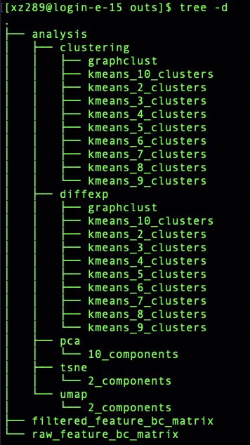

# scRNASeq analysis using R course (EBI) ::: Raw reads to expression matrix

> Taught by:: 'Xiaohui Zhao'  
> Contact E-mail:: 'xz289@cam.ac.uk'  
> Data Type:: '10xDropSeq, SmartSeq2'  
> Organism: Homo sapiens  
> Design: cell type comparison  
> Gestation age: 6-12 wks  
> Tissue: Placenta and Decidual  
> Reference paper Title: 'Single-cell reconstruction of the early maternal–fetal interface in humans'  
> Reference link:: 'https://www.nature.com/articles/s41586-018-0698-6'  

In this practical, we would like to explore our single cell RNASeq (scRNA) pipeline analysis first step. Generate the count matrix from the raw reads *fastq* files.
## Basic Unix/Linux command
Command     |   usage                                                 |
--------    | --------------------------------------------------------|
cd ~        |  change back to the home directory                      |
mv          |  rename file/directory                                  |
rm          |  remove file (careful using)                            |
head/tail   |  show the head/tail of the file                         |
ls          |  list files/directories in main directory               |
tree        |  view files and directories in a hierarchical structure |
mkdir       |  make directory                                         |
zcat        |  view gzip file                                         |

## Data Links ##
Description               | URL
---------------------     | ----------
Publication               | [[Nature]](https://) [[DOI]](https://doi.org/10.1038/s41586-018-0698-6)
Raw Data(10x)             | ArrayExpress EMBL-EBI [E-MTAB-6701](https://www.ebi.ac.uk/arrayexpress/experiments/E-MTAB-6701)
Raw Data(SS2)             | ArrayExpress EMBL-EBI [E-MTAB-6678](https://www.ebi.ac.uk/arrayexpress/experiments/E-MTAB-6678)

## 1) SmartSeq2
Libraries were sequenced aiming at an average depth of 1 million reads/cell, on an Illumina HiSeq 2000 with v4 chemistry (**paired-end 75-bp reads**). Libraries were made using Nextera XT	RNA was extracted, cDNA created and amplified, as part of the smart-seq 2 protocol.

### Customised Pipeline running with aligner Hisat2 (Similar as bulk RNASeq)
* a) Build index 
You need to build hisat2 reference for alignment if you did not have. There are different indices to build depends on your align requirements, eg. HFM index, HGFM index with SNPs or transcripts or both. Here we use HFM index. You do not need to build index as we already saved them in the practical.

               cd ./Practical_day2
               hisat2-build ./refdata-gex-GRCh38-2020-A/fasta/genome.fa ./refdata-gex-GRCh38-2020-A/fasta/GRCh38

The following files will be generated:  

            GRCh38.1.ht2, GRCh38.2.ht2, GRCh38.3.ht2, GRCh38.4.ht2,
            GRCh38.5.ht2, GRCh38.6.ht2, GRCh38.7.ht2, GRCh38.8.ht2.

* b) Check fastq file, quality contorl (fastQC+MultiQC) Align  

               cd ./Practical_day2/Data/SS2Data
               zcat ./Fastq/23728_8_119.1.fastq.gz | head

We will skip the QC check step in this practical for SmartSeq2 data.  

               hisat2 -x ../refdata-gex-GRCh38-2020-A/fasta/GRCh38 \
                      -1 ./Fastq/23728_8_119.1.fastq.gz \
                      -2 ./Fastq/23728_8_119.2.fastq.gz \
                      -S ./Fastq/23728_8_119.sam

* c) Data sorting  

               samtools view -bS ./Fastq/23728_8_119.sam > ./Fastq/23728_8_119_unsorted.bam
               samtools sort -o ./Fastq/23728_8_119_sorted.bam ./Fastq/23728_8_119_unsorted.bam
               rm ./Fastq/23728_8_119.sam

* d) Reads counts and extract the counts columns  
    -[1] One sample

               featureCounts -p -a ../refdata-gex-GRCh38-2020-A/genes/genes.gtf \
                             -t exon -g gene_id \
                             -o ./Fastq/23728_8_119_featureCounts.txt ./Fastq/23728_8_119_sorted.bam

               cut -f1,7 ./Fastq/23728_8_119_featureCounts.txt > ./Fastq/23728_8_119_featureCounts_mat.txt

 
    -[2] multiple samples

              featureCounts -p -a ../refdata-gex-GRCh38-2020-A/genes/genes.gtf \
                            -t exon -g gene_id \
                            -o ./Fastq/SS2_featureCounts.txt \
                            ./Fastq/Processed_Bam/23728_8_119_sorted.bam \
                            ./Fastq/Processed_Bam/24087_5_146_sorted.bam \
                            ./Fastq/Processed_Bam/24087_7_73_sorted.bam

               cut -f1,7-9 ./Fastq/SS2_featureCounts.txt > ./Fastq/SS2_EM.txt
               head ./Fastq/SS2_EM.txt

* f) Use R or linux command to merge the featureCounts output and generate your own gene/cell count matrix.

#### Alongside thinking...
* Alignment can use STAR, Kallisto, Salmon et al;
* Bash script for multiple SS2 data;
* QC checking, MultiQC.

## 2) 10xDropSeq
The libraries were sequenced on an Illumina HiSeq 4000 with v4 chemistry (*Paired-end*)  **Read 1**: 26 cycles;  
**i7 index**:8 cycles, **i5 index**: 0 cycles.  
**Read 2**: 98 cycles.

### Sample Information
| library_id                | Number of Cells    |
| ------------------------- |     ---------      |
| FCA7167219                |        672         |
| FCA7167221                |        1171        |
| FCA7167222                |        1764        |

Due to the memory problem for running **cellranger**, we applied the subsets of the original fastq files using "seqtk", randomly selected 10000 sequence from the original ones. The subsets names as FCA1, FCA2 and FCA3.  

### Data Processing ###
Raw sequencing files are run through the cellranger pipeline (v5.0.0) with the following two main functions **cellranger count** and **cellranger aggr** as we mentioned in the lecture.   We only run sample *FCA7167219* using **cellranger count**. For the **cellranger aggr** practical, we will use the output already done to perform the analysis to save the time and memory.  

### Method1: cellranger pipeline

#### cellranger count ####

           cd ./Practical_day2/Data/10xData
           cellranger count --id=FCA1_cellout \
                            --transcriptome= ../refdata-gex-GRCh38-2020-A \
                            --fastqs=FCA1_fastq \
                            --sample=FCA1 \
                            --expect-cells=1000 \
                            --localcores=8 \
                            --localmem=64

#### Summary report web_summary.html

#### Alongside thinking...
* Rename the *fastq* files as *FCA1_S1_L001_R1_001.fq.gz* or *FCA1_R1.fastq.gz*, what happens?;
* Path/Directory of your reference saved;
* Check the --id and --sample options;
* Expect number of cells;
* Settings of your running terminal machine;
* Check the folder filtered_feature_bc_matrix/features.tsv.gz file top 8 lines using linux commands;
                  ?? features.tsv.gz | ??
* Go through the output
             FCA1_cellout/outs/web_summary.html

#### cellranger aggr (**Don't run**)

*cellranger aggr is not designed for combining multiple sequencing runs of the same GEM Well. For that, you should pass a list of FASTQ files from multiple sequencing runs of the same GEM well to the --fastqs argument of cellranger count.*

              cellranger aggr --id=FCA123 \
                              --csv=FCA123_libraries.csv \
                              --normalize=none

#### Alongside thinking...

* Using R to generate your csv file;
* Check the dimension of the count matrix;
* if we change the --normalize from "none" to "mapped", what is the difference for the final matrix?
* R seurat package: **Read10x** to call the matrix "outs/count/filtered_feature_bc_matrix/"

## HPC pipeline information: NextFlow

We know single cell RNASeq analysis is high memory and also need more cpus to run based on the large number of cells. Thus, a high-performance-computing system is needed to be set up to make the run. Nextflow is a nice tools which has developed nf-core pipelines. You could install nextflow and any of Docker, Singularity or Podman for full pipeline reproducibility. Full details to check in the following two links,

                      https://www.nextflow.io/  https://nf-co.re/

Before running, you need to export your nextflow path, and if you use singularity you also need to export your singularity path. Additionally, you need to add **NXF_OPTS='-Xms1g -Xmx4g'** line, which will stop the nextflow program itself using up too much memory. You may also need to customise your .nextflow/config file if you had "Slurm" job submitting. To explore the two pipelines, you could go to the following links for usage details.

### smartseq2 pipeline devlopment version (nf-core/smartseq2)

                https://nf-co.re/smartseq2/dev/usage

### 10x pipeline devlopment version (nf-core/scrnaseq)

                https://nf-co.re/scrnaseq/1.0.0/docs/usage  

The following command lines are the ones I ran in our hpc for both smartseq2 and 10x with a defined config file.

eg.

              nextflow run nf-core/smartseq2 -r dev -profile singularity \
                                             --skip_tracer --skip_bracer \
                                             --reads '*{1,2}.fastq.gz' \
                                             --fasta ../../refdata-gex-GRCh38-2020-A/fasta/ \
                                             --gtf ../../refdata-gex-GRCh38-2020-A/genes/ \
                                             --aligner star \
                                             --email test@gmail.ac.uk \
                                             -with-report 10x_report.html &> 10x_nextflow_command.resume.log &

eg. (default aligner is alevin)

               nextflow run nf-core/scrnaseq -r 1.0.0 -resume --reads '*_R{1,2}_001.fastq.gz' \
                                             --fasta ../refdata-gex-GRCh38-2020-A/fasta/ \
                                             --gtf ../refdata-gex-GRCh38-2020-A/genes/ \
                                             -profile singularity \
                                             --email test@gmail.ac.uk \
                                             -with-report 10x_report.html &> 10x_nextflow_command.resume.log &

| Resource              | Version         |
| --------------------- | --------------- |
| Nextflow              | 	v20.10.0      |
| nf-core/smartseq2     | 	v1.0dev       |
| nf-core/scrnaseq      | 	v1.0.0        |
| FastQC                | 	v0.11.8       |
| MultiQC	              | 	v1.8          |
| STAR                  | 	v2.7.2c       |
| Hisat2                |   v2.2.1        |
| samtools              |   v1.11         |
| featureCounts         |   v2.0.1        |
| cellranger            |   v5.0.1        |
| Reference             |  GRCh38-2020A   |

### Contact ###

Contact Xiaohui Zhao (xz289 -at- cam.ac.uk) for related queries.
