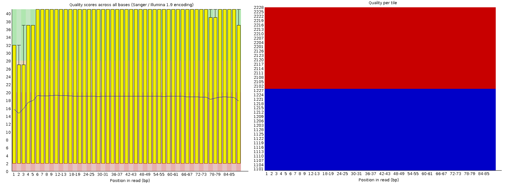
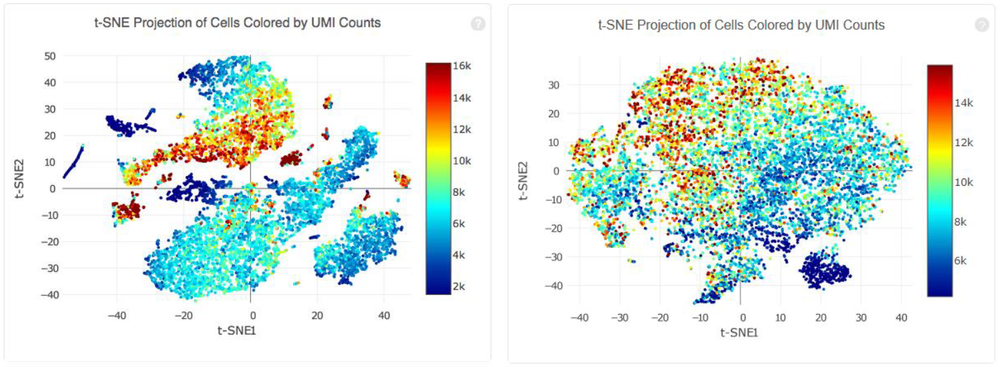

# Generate expression matrix for smartseq2 (SS2) and 10x single-cell RNA-seq data from raw reads

> Taught by:: 'Xiaohui Zhao' <br>
> Contact E-mail:: 'xz289@cam.ac.uk' <br>
> Data Type:: '10x, SmartSeq2' <br>

## Question on Part I: Smart Seq2 section 5.2
**Question** <br>
What do the 3 zeros at the end of line 4 mean for gene ENSG00000243485? <br>
**Answer** <br>
3 zeros represented the counts for gene ENSG00000243485 of cell 23728_8_119, 24087_5_146 and 24087_7_73 is 0.
## Challenge 1
Write a simple bash script pipeline with another aligner & check the expression matrix count for gene **TNFRSF14**.

**Answer**

In the example bash script, I applied **STAR** aligner. You could also play around with
different settings in STAR based on your own data requirements. <br>
(Run by *bash Challenge_1_bashscript_STAR.sh*) <br>
```bash
                      #!/usr/bin/bash
                      #if u use hpc or cluster server which softwares are saved as module.
                      module purge
                      module load subread-1.6.2-gcc-5.4.0-7zywp5u
                      module load samtools-1.9-gcc-5.4.0-vf6vvem
                      module load star/2.5.0a

                      datadir=/home/training/Practical_day2/SS2_Data/Fastq
                      refdir=/home/training/Practical_day2/refdata-gex-GRCh38-2020-A/star
                      gtfdir=/home/training/Practical_day2/refdata-gex-GRCh38-2020-A/genes

                      cd $datadir


                      for fastqs in $(ls *.fastq.gz | cut -f 1 -d "."| uniq);
                      do
                        STAR --runThreadN 8 --genomeDir ${refdir} \
                             --readFilesCommand zcat \
                             --readFilesIn ${fastqs}.1.fastq.gz  ${fastqs}.2.fastq.gz \
                             --outSAMtype BAM SortedByCoordinate \
                             --outFileNamePrefix ${fastqs}_ ;

                        samtools index ${fastqs}_Aligned.sortedByCoord.out.bam

                      done;

                      featureCounts -a  ${gtfdir}/genes.gtf \
                                    -t exon -g gene_id \
                                    -o STAR_QuantSeq_featureCounts.txt \
                                       24087_7_73_Aligned.sortedByCoord.out.bam \
                                       24087_5_146_Aligned.sortedByCoord.out.bam \
                                       23728_8_119_Aligned.sortedByCoord.out.bam

                      cut -f1,7-9 STAR_QuantSeq_featureCounts.txt > SS2_STAR_EM.txt
```
### more options you could add for filtering or quanlity control
         --outFilterType BySJout --outFilterMultimapNmax 20 --alignSJoverhangMin 8 --alignSJDBoverhangMin 1 \
         --outFilterMismatchNmax 999 --outFilterMismatchNoverLmax 0.1 --alignIntronMin 20 \
         --alignIntronMax 1000000 --alignMatesGapMax 1000000 --outSAMattributes NH HI NM MD \


**Hints** for checking "TNFRSF14" gene, ensemble gene id for PAEP is "ENSG00000157873".

My output for Hisat2/STAR with this gene counts are

        Aligner     Geneid          X23278_8_119_sorted.bam X24087_5_146_sorted.bam X24087_7_73_sorted.bam
        Hisat2      ENSG00000157873   10                      89                      171
        STAR        ENSG00000157873   19                      160                     309

## Exercise 2: (The web summary files are credited by Simon Andrews-Babaraham 10x cellranger teaching materials)
<br>
**Note** The link below for each report you may not view directly in your browser. You will see a txt file format for html! Please go to the folder CellRangerReports either in Github or the VM machine /home/Training/Practical_day2/10xData/CellRangerReports/ to open the html files.

* [isugenomics](CellRangerReports/web_summary_isugenomics.html) *Low Fraction Reads in Cells* <br>
  **Answer:** <br> <br>
    1) High ambient RNA (background) in your sample. This ambient RNA comes from lysed/dead cells in your sample. Cell Ranger is able to confidently align the reads from ambient RNA to the transcriptome but the reads are not associated with a valid cell-containing GEM.

    2) The cell-calling heuristic did not apply. For example, there may be higher variation in RNA content than expected (more cells with lower RNA content). The current cell-calling heuristic assumes a ten-fold variation in RNA content.

    Cell Ranger's algorithm for partitioning barcodes as cells versus background is based on the idea that barcodes for cells should have distinctly more transcript counts associated with them than the background barcodes. This can be visualized by the ranked barcode plot in the web_summary.html file. More details on the cell filtering algorithm can be found here.

    If you suspect that Cell Ranger's cell calling algorithm did not work well for your sample, please re-run cellranger count again or cellranger reanalyze with --force-cells option to call the expected number of cells.
* [ucdavis](CellRangerReports/web_summary_ucdavis.html) <br>
The barcode rank plot did not show a clearly drop to make the threshold for the cut-off of the cells. It may because there are a few cells there with low quality, or the tissue is taken from different experimental design, eg. cancer cells.

* [babraham](CellRangerReports/web_summary_babraham.html) *low fraction reads in cells* & *low number of cells detected* <br>
  **Answer** <br>
  Similar possibilities as [isugenomics](CellRangerReport/web_summary_isugenomics.html).

* [GSM2671416_P4](CellRangerReports/GSM2671416_P4_web_summary.html)
  Useful link for this data set web Summary
  [4k_PBMC_HealthDornor](https://gtpb.github.io/ADER19F/pages/L09)
* [test](CellRangerReports/test_web_summary.html) *Low Fraction Reads Confidently Mapped To Transcriptome* <br>

        47.5% mapping to genome & 28.2% Reads Mapped Confidently to Transcriptome

  **Answer** <br>
  1) Factors related to the Cell Ranger reference package:

  * Completeness of the assembly used for reference: more complete genomes are better.
  * The complexity of the genome/repeats: the repetitive nature of the genome can negatively influence mapping. Reads aligning non-uniquely to multiple genes are not considered for UMI counting. <br>
  * The number of overlapping gene annotations: reads aligning uniquely but to overlapping gene annotations are not considered for UMI counting.

  2) Factors related to library prep or sequencing quality:

  * RNA/sample quality: contamination of the sample with cells/RNA from other species would impact mapping rates. <br>
  * Read quality: higher quality reads should improve mapping rate. <br>
  * Read length: longer reads improve mapping, but only moderately. <br>



### Additional Questions answers:
* Does the coverage variation affect your data? <br>
 Yes, high coverage will have a better clustering for your data. <br>

 <br>

* If your cells vary, does the 'reads per cell' quantity make sense? <br>
The summary or means/median per cell will mislead when cells vary.

## Challenge 2
You have two publications of 10x data from the same tissue, but using different chemistry versions. You would like to combine these two data sets. Which pipeline should you choose, "count", "aggr", "reanalyse"? (Hint: check aggr and reanalyse!)

**Answer**
1) First, need to check whether they use the same version of cellranger run; <br>
2) If not, you need to decide which version you prefer, and rerun **cellranger count** with the selected version. And then use "aggr" or R seurat to merge the results; <br>
3) If yes, you could use "aggr" directly. <br>

"reanalyse" could be applied for target subset of data. <br>

**Remember**: different versions of Cellrangerhave reported raw and deduplicated counts –they can be *very* different!!

## Exercise 3: Count matrix
* Check the dimension of the count matrix;

```
library(Seurat)
datadir     <- "Practical_day2/10xData/FCA123_cellout/outs/filtered_feature_bc_matrix"
FCA123_data <- Read10X(data.dir=datadir,
                       gene.column=1) ## This is used gene_id as row names
dim(FCA123_data)
## [1] 36601  3607                       

```

* Which do you prefer - the R Matrix package or the seurat package (**Read10x** to get the expression matrix). How do you assign your matrix rownames: either by gene_id or gene_name? <br>

1) Read10X
```
library(Seurat)
datadir     <- "Practical_day2/10xData/FCA123_cellout/outs/filtered_feature_bc_matrix"
FCA123_data1 <- Read10X(data.dir=datadir,
                       gene.column=1) ## This is used gene_id as row names
FCA123_data2 <- Read10X(data.dir=datadir,
                      gene.column=2) ## This is used gene_symbol as row names                      

```
2) Matrix
```
library(Matrix)
matrix_dir = "/opt/FCA123_cellout/outs/filtered_feature_bc_matrix/"
barcode.path <- paste0(matrix_dir, "barcodes.tsv.gz")
features.path <- paste0(matrix_dir, "features.tsv.gz")
matrix.path <- paste0(matrix_dir, "matrix.mtx.gz")
mat <- readMM(file = matrix.path)
feature.names = read.delim(features.path,
                           header = FALSE,
                           stringsAsFactors = FALSE)
barcode.names = read.delim(barcode.path,
                           header = FALSE,
                           stringsAsFactors = FALSE)
## use gene_id
colnames(mat) = barcode.names$V1
rownames(mat) = feature.names$V1
## use gene_symbol
colnames(mat) = barcode.names$V2
rownames(mat) = feature.names$V2


```
